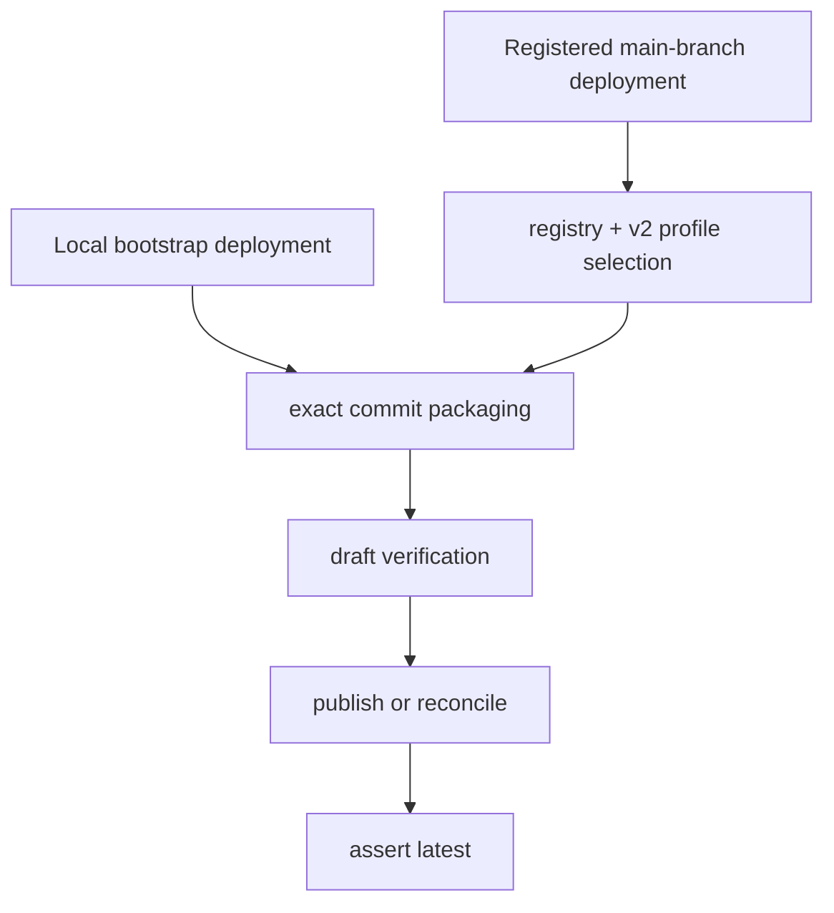

# Deployment

Deployment is a separate lifecycle from bootstrap and optimize job. The code
supports two entry paths with one shared exact-source rule:

1. bootstrap local deployment from the exact reviewed local commit
2. registered main-branch deployment from the committed registry and v2
   profile

Neither path mutates an explicit Foundry route.

## Deployment modules

- local bootstrap deployment:
  [`src/foundry_opt/bootstrap/local_commit.py`](../../src/foundry_opt/bootstrap/local_commit.py)
  and
  [`src/foundry_opt/bootstrap/local_deploy.py`](../../src/foundry_opt/bootstrap/local_deploy.py)
- registered deployment selection:
  [`src/foundry_opt/bootstrap/workflow_integration.py`](../../src/foundry_opt/bootstrap/workflow_integration.py)
- shared deployment implementation:
  [`src/foundry_opt/poc/deploy.py`](../../src/foundry_opt/poc/deploy.py)
- exact packaging:
  [`src/foundry_opt/poc/source.py`](../../src/foundry_opt/poc/source.py) and
  [`src/foundry_opt/packaging/`](../../src/foundry_opt/packaging/)

## Two entry paths

| Path | Interface | Exact source | Reconciliation |
| --- | --- | --- | --- |
| Local bootstrap deployment | separate bootstrap deployment approval | the reviewed local commit created by [`local_commit.py`](../../src/foundry_opt/bootstrap/local_commit.py) | if the target already matches, the deployment module may reconcile instead of publishing |
| Registered main-branch deployment | workflow matrix built from the registry and selected v2 profile | `github.sha` plus the selected `source_root` | matching latest content becomes a reconciled result instead of a duplicate version |

## Shared flow

## Local bootstrap deployment

Local bootstrap deployment is approval-bound inside the bootstrap runtime:

- repository setup and connection happen first
- bootstrap creates one reviewed local branch and exact commit
- deployment review is per enabled agent and per reviewed Foundry target
- publication uses the current local Azure identity
- the resulting receipt records published or reconciled status per agent

This path is intentionally exact-commit local deployment, not "deploy whatever
is in the working tree now."

## Registered main-branch deployment

Registered deployment is repository-driven:

- the changed-path matrix expands shared-contract changes to every enabled
  agent
- [`resolve_registry_selection(...)`](../../src/foundry_opt/bootstrap/workflow_integration.py)
  loads the registry and selected v2 profile
- the deployment plan freezes registry hash, profile hash, selected
  `package_root`, and verification inputs
- publication runs only from the exact main-branch commit under review

This is the path that reconciles registered deployment on main without route
mutation.

## Reconciliation without route mutation

[`DeploymentService`](../../src/foundry_opt/poc/deploy.py) first requires
service-managed latest behavior. It then:

1. packages the exact commit
2. verifies the uploaded draft bytes
3. checks whether the latest regular version already contains the same exact
   ZIP and reconciliation metadata
4. returns a reconciled result when the content already matches
5. otherwise publishes one new immutable regular version
6. verifies that the published version is latest

If the route exposes an explicit version selector, deployment fails closed
instead of inferring a route-mutation strategy.

## Verification modes

Deployment verification comes from the selected v2 profile:

- Foundry evaluation
- repository checks
- none

Bootstrap may leave verification unset or deferred. When that happens, the
resulting deployment warning must stay honest instead of implying evaluation
evidence that does not exist.

## Stable invariants

- exact commit packaging, never dirty-tree bytes
- exact uploaded/downloaded archive match
- no explicit route mutation
- duplicate content reconciles instead of publishing a duplicate version
- post-publish verification must confirm the published version is latest

## Related architecture

- [System overview](system-overview.md)
- [Optimize job](optimize-job.md)
- [Trust model](trust-model.md)
- [Distribution and pinning](../distribution.md)
