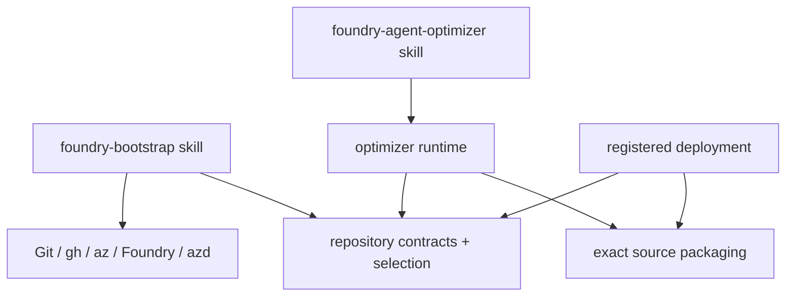

# Module map

## Dependency view

## Modules

| Module | Interface | Responsibility |
| --- | --- | --- |
| [`plugins/foundry-bootstrap/`](../../plugins/foundry-bootstrap/) | `/foundry-bootstrap` | Conversational discovery, one approval, repository/cloud mutation, report, local commit, and azd deployment |
| [`repository_contracts.py`](../../src/foundry_opt/repository_contracts.py) | Registry and agent-profile models | Neutral committed repository contract |
| [`repository_selection.py`](../../src/foundry_opt/repository_selection.py) | Registry selection and changed-path matrix | Shared optimizer/deployment selection rules |
| [`source_discovery.py`](../../src/foundry_opt/source_discovery.py) | Source fingerprints | Exact-source comparisons used outside bootstrap |
| [`poc/registry_runtime.py`](../../src/foundry_opt/poc/registry_runtime.py) | Registry selection to runtime contracts | Projects per-agent sidecars into shared optimizer/deployment policy, metadata, model, evaluation, and OIDC contracts |
| [`poc/runtime.py`](../../src/foundry_opt/poc/runtime.py) | Optimize-job runtime | Draft evaluation, candidate state, and broker handoff |
| [`poc/deploy.py`](../../src/foundry_opt/poc/deploy.py) | Registered verify/publish commands | Exact-source production verification and publication |
| [`packaging/`](../../src/foundry_opt/packaging/) | Deterministic package builders | Exact source archives for optimizer and registered deployment |

## External tools

The skill uses real external seams directly:

- Git and repository file tools;
- GitHub CLI for environments and variables;
- Azure CLI or Azure tools for identity, federation, and RBAC;
- Foundry tools for inventory and verification;
- Azure Developer CLI with `azure.ai.agents` for local source deployment.

Bootstrap has no provider adapters or in-process state machine.
