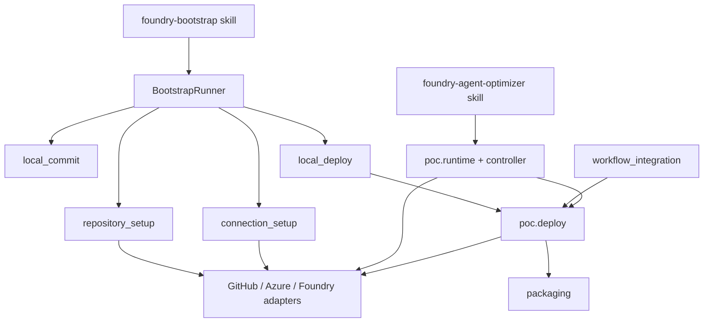

# Module map

This map uses the codebase-design vocabulary deliberately: each entry is a
module with an interface at a seam. Where external behavior varies, concrete
adapters satisfy that interface. The goal is depth, leverage, and locality,
not a long list of shallow wrappers.

## Dependency view

## Deep modules

| Module | Interface at the seam | Implementation behind it | Why it is deep |
| --- | --- | --- | --- |
| [`plugins/foundry-bootstrap/`](../../plugins/foundry-bootstrap/) | `/foundry-bootstrap` plus the five bridge operations in [`scripts/bootstrap.py`](../../plugins/foundry-bootstrap/scripts/bootstrap.py) | skill instructions, exact runtime installation, owner-turn formatting | Small interface, high leverage: owners do not learn plan JSON, receipt hashes, or provider sequencing. |
| [`src/foundry_opt/bootstrap/runner.py`](../../src/foundry_opt/bootstrap/runner.py) | [`BootstrapRunner`](../../src/foundry_opt/bootstrap/runner.py) `start`, `answer`, `approve`, `status`, `rollback` | discovery, lifecycle state, question routing, approvals, child-step rollback | This is the deepest bootstrap module. One seam hides the whole staged bootstrap lifecycle and concentrates locality in one state machine. |
| [`src/foundry_opt/bootstrap/discovery/`](../../src/foundry_opt/bootstrap/discovery/) | `discover_repository_agents(...)` | repository scan, runtime readiness detection, binding classification, blocker detection | Callers learn one interface and get candidate inventory, fingerprints, and binding posture. |
| [`src/foundry_opt/bootstrap/foundry_targets.py`](../../src/foundry_opt/bootstrap/foundry_targets.py) | target-resolution handler used by `BootstrapRunner` | metadata reuse, owner-answer merge, Foundry data-plane inspection, blocked-target handling | The seam keeps adaptive input collection small while the implementation owns target validation and classification. |
| [`src/foundry_opt/bootstrap/repository_setup.py`](../../src/foundry_opt/bootstrap/repository_setup.py) | repository review and approval handler | manifest loading, registry rendering, v2 profile creation, lock generation, rollback | High leverage for callers: one approval applies all managed file mutations. |
| [`src/foundry_opt/bootstrap/connection_setup.py`](../../src/foundry_opt/bootstrap/connection_setup.py) | connection review and approval handler | GitHub environment planning, Azure identity planning, exact OIDC subjects, RBAC, compensation, registry reconciliation | The interface is one owner decision; the implementation hides multi-step GitHub and Azure mutation order. |
| [`src/foundry_opt/bootstrap/local_commit.py`](../../src/foundry_opt/bootstrap/local_commit.py) | reviewed-commit review and approval | exact path checks, branch naming, commit creation, rollback | Depth comes from collapsing many Git safety rules into one commit seam. |
| [`src/foundry_opt/bootstrap/local_deploy.py`](../../src/foundry_opt/bootstrap/local_deploy.py) | local deployment review and approval | per-agent deployment plans, exact-commit checks, receipt writing, resume | One seam deploys reviewed enabled agents from one exact local commit. |
| [`src/foundry_opt/bootstrap/workflow_integration.py`](../../src/foundry_opt/bootstrap/workflow_integration.py) | registry selection and deployment-plan builders | changed-path expansion, enabled-agent selection, registry/profile fingerprint inputs | This module gives leverage to GitHub workflows by hiding repository-wide selection rules behind a small interface. |
| [`src/foundry_opt/poc/runtime.py`](../../src/foundry_opt/poc/runtime.py) and [`controller.py`](../../src/foundry_opt/poc/controller.py) | optimize-job CLI/runtime entrypoints | job identity, route capture, handoff, evaluation ordering, cleanup, resume | One interface drives the whole optimize-job loop while keeping candidate and Foundry complexity local. |
| [`src/foundry_opt/poc/deploy.py`](../../src/foundry_opt/poc/deploy.py) | deployment preflight, verify, and publish entrypoints | exact packaging checks, draft verification, reconciliation, latest verification, no-route-mutation enforcement | The deployment module is deep because callers get exact-source publication and reconciliation from a small interface. |
| [`src/foundry_opt/packaging/`](../../src/foundry_opt/packaging/) | deterministic ZIP builders and release builders | file normalization, archive verification, skill-lock materialization | Packaging is a leverage module: both bootstrap release packaging and deployment reuse the same deterministic rules. |

## Adapters at external seams

- Bootstrap adapters:
  [`providers/github.py`](../../src/foundry_opt/bootstrap/providers/github.py),
  [`providers/azure.py`](../../src/foundry_opt/bootstrap/providers/azure.py),
  [`providers/foundry.py`](../../src/foundry_opt/bootstrap/providers/foundry.py)
- Optimize-job and deployment adapters:
  [`poc/github.py`](../../src/foundry_opt/poc/github.py),
  [`poc/auth.py`](../../src/foundry_opt/poc/auth.py),
  [`poc/foundry.py`](../../src/foundry_opt/poc/foundry.py)

These adapters sit at real seams: production code crosses GitHub, Azure, and
Foundry, while tests supply in-memory or fake adapters under
[`tests/`](../../tests/).

## Current architectural center

The repository has two especially deep modules:

1. [`BootstrapRunner`](../../src/foundry_opt/bootstrap/runner.py) for the
   owner bootstrap lifecycle
2. [`DeploymentService`](../../src/foundry_opt/poc/deploy.py) for exact-source
   release publication and reconciliation

Everything else either feeds those modules or adapts external systems to their
interfaces.

## Related architecture

- [System overview](system-overview.md)
- [Skill and runtime seam](skill-runtime-seam.md)
- [Optimize job](optimize-job.md)
- [Deployment](deployment.md)
