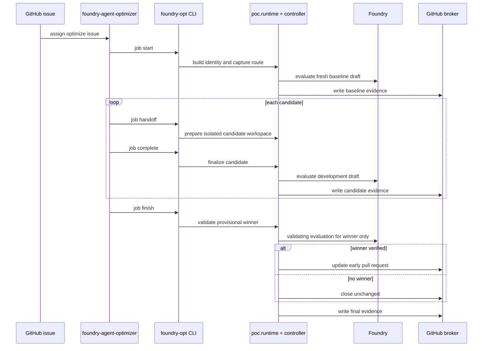

# Optimize job

The optimize job is the issue-driven lifecycle. It starts from the committed
registry and one selected v2 profile, evaluates a fresh baseline, evaluates
bounded candidates, validates only the provisional winner on the validating
dataset, and then either updates the early pull request or closes it
unchanged.

## Authoritative inputs

- `.foundry-opt/registry.yaml` selects enabled agents
- each selected `config_path` points at a v2 profile
- issue input may narrow behavior, but it cannot widen repository policy
- exact Git commits define source, baseline, and winner projection

The legacy single-agent pin files are migration input, not the active
optimize-job contract.

Bootstrap commits the exact optimizer project skill at
`.github/skills/foundry-agent-optimizer`. Copilot setup verifies it against the
pinned runtime, creates trusted job-state paths, and launches the issue broker
for the cloud agent's `dynamic` event. If skill discovery or broker launch
fails, the cloud agent must stop without editing.

## Main modules

- skill adapter:
  [`plugins/foundry-agent-optimizer/`](../../plugins/foundry-agent-optimizer/)
- CLI module:
  [`src/foundry_opt/cli.py`](../../src/foundry_opt/cli.py)
- runtime module:
  [`src/foundry_opt/poc/runtime.py`](../../src/foundry_opt/poc/runtime.py)
- controller module:
  [`src/foundry_opt/poc/controller.py`](../../src/foundry_opt/poc/controller.py)
- state module:
  [`src/foundry_opt/poc/state.py`](../../src/foundry_opt/poc/state.py)
- candidate module:
  [`src/foundry_opt/poc/candidate.py`](../../src/foundry_opt/poc/candidate.py)
- Foundry adapter module:
  [`src/foundry_opt/poc/foundry.py`](../../src/foundry_opt/poc/foundry.py)

## Flow

## What the interface guarantees

The optimize-job interface is small relative to the implementation:

- one fresh baseline per job
- bounded candidate count from the selected profile
- isolated candidate worktrees
- exact draft ownership and cleanup
- route fingerprint capture and drift failure
- validating dataset used only for the provisional winner
- redacted durable evidence

That depth gives leverage to the skill caller: it asks for the next action and
does not need to coordinate candidate state by hand.

## Honest evidence labels

Optimize-job output must keep labels matched to evidence:

- `winner` - quantitative verification ran and one candidate won
- `no_winner` - quantitative verification ran and no candidate won
- `recommended` - repository checks support a recommendation, but there is no
  measured Foundry winner
- `proposed_unverified` - a change exists, but evidence does not justify a
  stronger label

## Important invariants

- issue input narrows policy; it never widens policy
- only draft versions are used during optimization
- optimize jobs never mutate a Foundry route
- raw model content, raw evaluation artifacts, and credentials stay out of
  GitHub evidence
- platform failures are not candidate scores

## Decision and cleanup locality

Decision logic stays in
[`decision.py`](../../src/foundry_opt/poc/decision.py). Cleanup and resume
locality stays in
[`controller.py`](../../src/foundry_opt/poc/controller.py) and
[`state.py`](../../src/foundry_opt/poc/state.py). That split keeps ranking,
cleanup, and state-machine rules concentrated in a few deep modules instead of
spreading them across the skill or callers.

## Related architecture

- [System overview](system-overview.md)
- [Deployment](deployment.md)
- [Trust model](trust-model.md)
