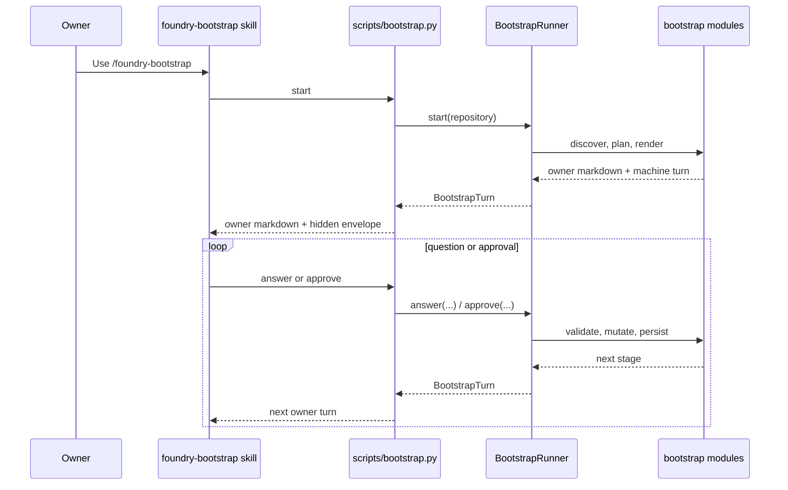

# Skill and runtime seam

Bootstrap is intentionally split at one small seam. The owner-facing skill is
adaptive and conversational. The runtime is deterministic and receipt-backed.

## The seam

The bootstrap owner interface is exactly five bridge operations:

- `start`
- `answer`
- `approve`
- `status`
- `rollback`

The checked-in bridge lives in
[`plugins/foundry-bootstrap/scripts/bootstrap.py`](../../plugins/foundry-bootstrap/scripts/bootstrap.py).
Its job is to carry owner turns across the seam, not to reimplement bootstrap.

## Ownership split

| Side of the seam | Module | What it owns |
| --- | --- | --- |
| Owner-facing side | [`plugins/foundry-bootstrap/SKILL.md`](../../plugins/foundry-bootstrap/SKILL.md) and [`scripts/bootstrap.py`](../../plugins/foundry-bootstrap/scripts/bootstrap.py) | owner wording, exact runtime install and re-exec, adaptive repository inspection, adaptive Azure management-plane lookup, choice collection |
| Runtime side | [`src/foundry_opt/bootstrap/runner.py`](../../src/foundry_opt/bootstrap/runner.py) and child modules under [`src/foundry_opt/bootstrap/`](../../src/foundry_opt/bootstrap/) | deterministic validation, lifecycle state, stage transitions, repository mutations, connection mutations, local commit creation, local deployment, receipts, resume, rollback |

One rule is deliberate: Foundry data-plane inspection remains runtime-owned.
The skill may help resolve endpoint or account inputs, but target inventory,
binding observation, and deployment readiness stay in
[`foundry_targets.py`](../../src/foundry_opt/bootstrap/foundry_targets.py)
and the Foundry adapter modules.

## Why this seam is deep

The external interface is tiny, but the implementation behind it is large:

- discovery and binding classification
- register/enable decisions
- reviewed Foundry target validation
- repository plan rendering and apply
- GitHub-to-Azure connection planning and compensation
- exact reviewed local commit creation
- optional exact-commit local deployment
- persistent state, receipts, and rollback

That depth gives leverage to the skill caller and locality to maintainers. The
skill can stay simple while bootstrap rules change in one runtime module.

## Owner flow across the seam

## Default caller

Standard Copilot plus installed skills is the default adapter at this seam.
Bootstrap does not require a custom agent and does not switch to one
automatically. An optional custom agent is only another caller-side adapter
for teams that deliberately choose it.

## Exact runtime contract

The downloaded skill keeps a materialized `skill.lock.json` and re-executes
through the exact reviewed runtime commit. Source checkouts import their own
tree directly. In both cases the runtime, not the skill text, is the mutation
authority.

See:

- [`plugins/foundry-bootstrap/references/owner-flow.md`](../../plugins/foundry-bootstrap/references/owner-flow.md)
- [`plugins/foundry-bootstrap/references/security.md`](../../plugins/foundry-bootstrap/references/security.md)
- [`docs/owner-review.md`](../owner-review.md)

## Related architecture

- [System overview](system-overview.md)
- [Module map](module-map.md)
- [Trust model](trust-model.md)
