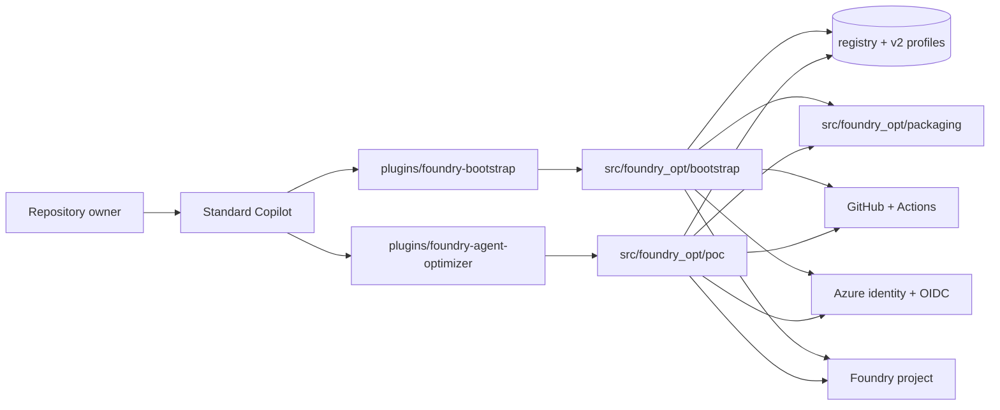

# System overview

Foundry Optimizer is organized around three separate lifecycles:
bootstrap, optimize job, and deployment. The repository keeps each
lifecycle small at the interface and deep in the implementation so the
owner and issue flows stay plain-language while the runtime keeps the
deterministic work local.

## Top-level modules

- [`plugins/foundry-bootstrap/`](../../plugins/foundry-bootstrap/) -
  owner-facing bootstrap skill module
- [`plugins/foundry-agent-optimizer/`](../../plugins/foundry-agent-optimizer/) -
  issue-time optimizer skill module
- [`src/foundry_opt/bootstrap/`](../../src/foundry_opt/bootstrap/) -
  bootstrap runtime module
- [`src/foundry_opt/poc/`](../../src/foundry_opt/poc/) - optimize-job and
  registered deployment runtime module
- [`src/foundry_opt/packaging/`](../../src/foundry_opt/packaging/) -
  deterministic packaging module

The committed repository contract is now repository-wide:
`.foundry-opt/registry.yaml` selects managed agents and each agent keeps its
own v2 profile at `config_path`. The old lock-centric single-agent contract
is legacy migration input, not the active architecture.

## Three lifecycles

### Bootstrap

Bootstrap is the first-time owner lifecycle. Standard Copilot plus installed
skills is the default caller. The owner uses `/foundry-bootstrap`, the skill
crosses a five-operation seam (`start`, `answer`, `approve`, `status`,
`rollback`), and the runtime records:

- discovered agents and register/enable decisions
- reviewed Foundry targets
- reviewed repository mutations
- one repository-wide identity with separate GitHub environment credentials
- an exact reviewed local commit
- optional exact-commit local deployment

Verification is optional during bootstrap. The owner may configure it now,
defer it, use repository checks, or continue with no evidence and an explicit
warning.

### Optimize job

The optimize job is the issue-driven lifecycle. It uses the committed
registry, one selected v2 profile, and the issue-time skill to:

- capture exact job identity and route fingerprint
- evaluate one fresh baseline draft
- evaluate bounded candidate drafts
- validate only the provisional winner on the validating dataset
- project only the verified winner to the early pull request
- keep evidence labels honest: `winner`, `no_winner`, `recommended`, or
  `proposed_unverified`

### Deployment

Deployment is the release lifecycle. It has two entry paths:

- bootstrap local deployment from the exact reviewed local commit
- registered main-branch deployment from the committed registry and v2 profile

Both paths package exact source, verify the uploaded bytes, reconcile matching
latest content when possible, and never mutate an explicit Foundry route.

## System shape

## Stable invariants

- exact reviewed runtime commit for privileged bootstrap work
- exact Git commit packaging for deployment
- OIDC for GitHub-hosted cloud access; no static Azure credential fallback
- one repository-wide identity by default, with separate environment
  federation for `copilot` and `foundry-production`
- evaluation optional during bootstrap
- Foundry data-plane inspection owned by runtime modules
- no explicit route mutation during optimize job or deployment

## Related architecture

- [Module map](module-map.md)
- [Skill and runtime seam](skill-runtime-seam.md)
- [Optimize job](optimize-job.md)
- [Deployment](deployment.md)
- [Trust model](trust-model.md)
