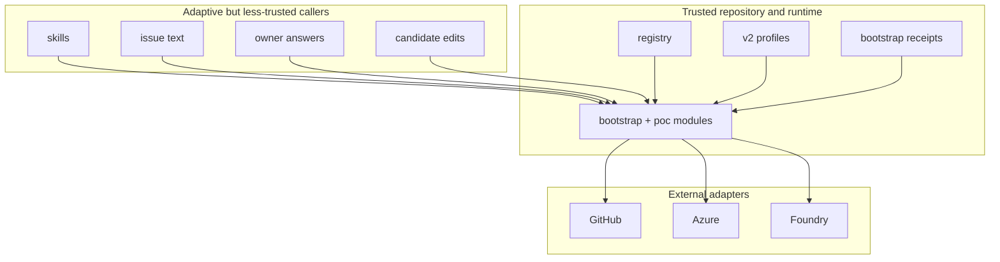

# Trust model

Foundry Optimizer narrows trust aggressively. The rule is consistent across
bootstrap, optimize job, and deployment: adaptive callers may propose or
narrow, but only trusted repository state and deterministic runtime modules may
authorize mutation.

## Trusted inputs and state

The active repository contract is:

- `.foundry-opt/registry.yaml`
- one v2 profile per selected `config_path`
- exact reviewed runtime commit and skill lock for downloaded bootstrap
- exact Git commits for optimize-job and deployment source

Bootstrap receipts and operation state are also trusted, but they live outside
the customer repository or in workflow artifacts rather than in tracked
source.

The old `.github/foundry-opt.lock.yml` document is legacy migration input. It
is not the active repository authority.

## Less-trusted inputs

- issue prose
- owner free-text answers
- Copilot candidate edits
- mutable working-tree bytes outside the reviewed commit
- external results before runtime validation

These inputs may guide behavior, but they do not widen policy or bypass exact
validation.

## Trust split at the bootstrap seam

- Skill-side modules may inspect repository files adaptively and perform Azure
  management-plane lookup to help answer a target question.
- Runtime-side modules own deterministic validation, state transitions,
  classification, mutations, receipts, and rollback.
- Foundry data-plane inspection remains runtime-owned.

That seam keeps trust concentrated in the reviewed runtime implementation.

## Identity model

Bootstrap uses one repository-wide identity by default, with separate GitHub
environment credentials for `copilot` and `foundry-production`. In practice
that means:

- one reviewed identity resource in the registry
- one exact OIDC subject per GitHub environment
- no static Azure credentials in repository files or runtime state

Local bootstrap deployment is different only in where the credential adapter
comes from: it uses the current local Azure identity, but it still deploys the
same reviewed exact commit and target.

## Exact source and locality

- bootstrap local deployment requires the reviewed local commit
- registered deployment requires the reviewed main-branch commit
- optimize-job candidate work stays inside allowed editable paths
- published or reconciled versions must match exact packaged bytes

This gives locality to debugging: if the exact bytes or exact commit do not
match, the runtime fails in one place instead of spreading ambiguity across
callers.

## Protected modules and adapters

- GitHub trust seam:
  [`src/foundry_opt/poc/github.py`](../../src/foundry_opt/poc/github.py)
- Azure OIDC trust seam:
  [`src/foundry_opt/poc/auth.py`](../../src/foundry_opt/poc/auth.py)
- Foundry trust seam:
  [`src/foundry_opt/poc/foundry.py`](../../src/foundry_opt/poc/foundry.py)
- Bootstrap provider adapters:
  [`src/foundry_opt/bootstrap/providers/`](../../src/foundry_opt/bootstrap/providers/)

These adapters are the only modules that should need transport-specific trust
knowledge. The higher-level modules consume their interfaces and keep policy
rules local.

## Redaction

Durable state and evidence are intentionally narrow:

- no raw model content
- no raw evaluation artifacts
- no secrets or credential material
- no hidden route mutation records, because route mutation is not part of the
  architecture

The runtime keeps hashes, identifiers, reviewed targets, and redacted receipts
instead.

## Trust zones

## Related architecture

- [System overview](system-overview.md)
- [Skill and runtime seam](skill-runtime-seam.md)
- [Deployment](deployment.md)
- [Identity and RBAC](../identity-rbac.md)
- [Managed files](../managed-files.md)
