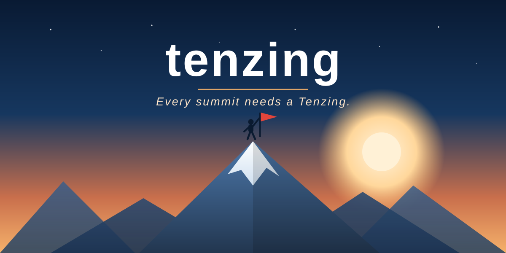

<p align="center">
  
</p>

<h3 align="center"><em>Every summit needs a Tenzing.</em></h3>

---

**Tenzing** is a template for building an **autonomous improvement loop**: point an agent at a metric,
and it brainstorms ideas, runs each as an experiment on its own branch, measures the result, keeps
what works, discards what doesn't — and climbs, one experiment at a time.

It is derivative-free hill-climbing driven by an agent: named after Tenzing Norgay, the guide who
does the hard climbing so you reach the summit. The agent climbs; you keep the summits.

## What's in the box

```
tenzing/
├── climb.md                        # the steady-state loop: ideas → branch → implement → evaluate → track → repeat
├── INIT.md                         # run ONCE: an agent interviews you and fills in the loop, then deletes itself
├── climb_config/                   # the swappable, per-project pieces
│   ├── background.md               #   the problem and why it matters
│   ├── objective.md                #   the primary metric (+ direction), soft constraints, simplicity tiebreaker
│   ├── dos-and-donts.md            #   the editable area, read-only files, optional leakage rule
│   ├── evaluation.md               #   the exact commands to produce and score a run
│   ├── environment.md              #   toolchain and setup/dev commands
│   ├── data.md                     #   (optional) data inputs and held-out-set discipline
│   └── tracking-experiments.md     #   durable memory + per-branch evidence + the results.tsv scoreboard
└── assets/logo.svg
```

The core scaffold is **language- and domain-agnostic** — pure markdown protocol plus a
branch-per-experiment git workflow. Everything language- or problem-specific is a placeholder that
you fill in per project.

## How it works

- **`climb.md`** is the loop the agent runs forever (or until your chosen stopping point): generate
  a few ideas, implement each on its own branch, evaluate it, and log the outcome.
- **`climb_config/`** holds the pieces that make the loop concrete: what you're improving, the metric, the
  editable area, and how to score a run.
- **Two memories:** `experiment_tracking/` is gitignored durable memory of the whole run (ideas +
  the `results.tsv` scoreboard) that survives reverts; `experiment_metadata/` is committed
  per-branch so each experiment carries its own evidence trail.

## Getting started

The mental model: **you** define what "better" means and how to measure it (once, via `INIT.md`);
**the agent** does the tireless climbing — trying ideas, keeping what works, discarding what
doesn't — while you review the summits it brings back.

### 1. Create your project from the template

Pick whichever fits how you work:

- **Use this template (recommended for a new repo).** Click the green **Use this template** button
  on this repo → **Create a new repository**. You get a fresh repo with all the tenzing files and a
  clean history. Clone it locally.
- **Clone and modify.** Clone this repo directly and make it your own (reset the git history if you
  don't want tenzing's commits).
- **Drop into an existing project.** Copy just `climb_config/`, `INIT.md`, and `climb.md` into the root of
  a project you already have, then run the init step from there. This scaffolds the loop around your
  existing code without starting a new repo.

### 2. Initialize the loop (run once)

Point an AI coding agent at the repo and tell it:

> Read `INIT.md` and set up my improvement loop.

The agent interviews you one question at a time to learn your problem:

- **What are you improving?** — the background and why it matters.
- **Primary metric + direction** — the single number that decides if one experiment beats another,
  and whether to maximize or minimize it (e.g. accuracy ↑, latency ↓).
- **Soft constraints** — secondary quantities that must not blow up (memory, cost, runtime…).
- **Editable area & read-only files** — the one directory it may change, and what's off-limits.
- **Held-out eval set?** — if one exists, it adds a rule against peeking (leakage protection).
- **Evaluation commands** — the exact commands to produce a run and score it.
- **Environment** — your toolchain and setup commands.
- **Termination condition** — when the loop should stop: `forever`, after `N` experiments,
  `until-target` metric, or `report-each`.

It writes your answers into `climb_config/*.md` and `climb.md`, sets up the gitignored
`experiment_tracking/` memory, optionally records a **baseline** score, then **deletes `INIT.md`**.
Your loop is now defined.

### 3. Run the loop

Point the agent at the loop:

> Read `climb.md` and start climbing.

It now runs autonomously:

1. **Brainstorms** 2-3 ideas and saves each to `experiment_tracking/ideas/`.
2. For each idea: **creates a branch** → implements it in your editable area → **evaluates** it →
   logs the outcome (`keep` / `discard` / `crash`) to `results.tsv` → commits the branch with its
   evidence in `experiment_metadata/`.
3. **Loops** back to brainstorming — until your termination condition is met.

### 4. Review the results

- **`experiment_tracking/results.tsv`** — the scoreboard: every experiment's metric at a glance.
- **`experiment_tracking/ideas/`** — the full write-up of each idea (motivation, results, lessons).
- **Each experiment branch** — check it out to see the exact code plus its `experiment_metadata/`
  evidence trail.

The winning experiments are just branches — merge the ones you like into `main`.

## License

See `LICENSE`.
