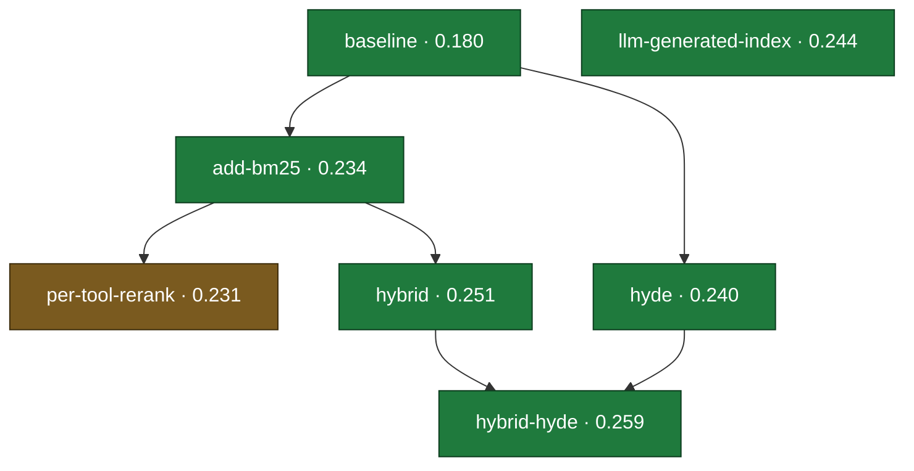

# Ideas and Experiments Tracking

The loop keeps memory in two places. Understanding the split is important: one store is the durable,
revert-proof memory of the **whole run**; the other is the committed evidence trail of a **single
experiment**.

## `experiment_tracking/` — durable memory of the whole run (gitignored)

Information that must survive across ideas and experiments lives in a `.gitignored` folder called
`experiment_tracking/`. Because it is gitignored, its contents persist across branch checkouts,
commits, and `git reset`s — so it is the durable memory of the entire run. Create it on the first
attempt if it does not already exist:

```
experiment_tracking/
├── ideas/
│   ├── idea-name-1.md
│   ├── idea-name-2.md
│   └── ...
├── results.tsv
└── tree.md
```

**Never commit `experiment_tracking/`** — it is deliberately untracked so entries written just
before a revert are not wiped out.

### Ideas

Each idea is one markdown file under `experiment_tracking/ideas/`. The file name is lower-case and
hyphen-separated, and matches the experiment branch name. Use this structure:

```
## Title

## Lineage
>> Which prior experiment(s) this one is derived from — its **parent(s)**. Lineage is **optional**;
>> an experiment can be any one of these:
>> - **single parent** — builds on one existing experiment.
>> - **baseline** — builds on the `baseline`.
>> - **multiple parents** — combines two or more prior experiments (a merge).
>> - **no parent (`-`)** — a wholly new line of thinking that starts its own **island** (a separate
>>   root) rather than descending from anything tried so far.
>>
>> The baseline is one root (parent `-`); each independent new direction is an additional root, so the
>> graph is a multi-root DAG (a forest of islands). Briefly, what does this change or combine relative
>> to its parent(s)? This lineage is what lets the whole run be reconstructed as an exploration DAG.

## Motivation
>> Why do we think this idea will work?

## Description
>> Detailed description of the idea including implementation details, discussion, etc.

## Experimental Results
>> The primary metric (and soft-constraint measurements) compared against the baseline / current best.
>> Analysis of *why* the numbers came out as they did: error analysis, ablations, qualitative examples.
>> Cost / performance: runtime, resource footprint, and any timeout/failure behavior.

## Lessons learned
>> What this experiment taught you, plus limitations / threats to validity — caveats, things not
>> tested, possible confounds.

## Reproducibility
>> The exact commands run to set up, execute, and evaluate the experiment, and why the results are valid.

## References
>> Papers, articles, docs, or prior reports consulted, with links where available.
```

Not every section applies to every experiment (a crash report may omit results, lessons, etc.), but
keep the headings consistent so reports are easy to scan across branches.

**Equations:** when an idea file needs to express math, write it as **LaTeX inside the markdown** —
`$...$` for inline math and `$$...$$` for a display equation (e.g. `$\text{recall}@k$`, or
`$$\text{nDCG} = \frac{DCG}{IDCG}$$`). This renders natively on GitHub, and in VS Code's preview
with a math extension (e.g. *Markdown+Math* / *Markdown All in One*); even unrendered, the LaTeX
source stays precise and readable. Note: write the math as normal prose — LaTeX does **not** render
inside a fenced ``` code block.

### `results.tsv` — the scoreboard

`results.tsv` is a terse, **tab-separated** table of every experiment's headline numbers — the
at-a-glance scoreboard you scan when choosing a starting point. Tab-separated (not comma) keeps
columns unambiguous even when a field contains commas.

The columns are (header row required):

```
{{RESULTS_TSV_HEADER}}
```

Where:

- `experiment_branch` — the branch the experiment lives on.
- `idea_file` — the idea's markdown file under `experiment_tracking/ideas/` (same name as the branch).
- `parent` — the experiment(s) this one was **derived from**. Lineage is optional and need not be a
  single parent. An experiment can build on one prior experiment, on the `baseline`, on **several**
  parents at once (comma-separated — a merge), or on **nothing** (`-`) — a brand-new independent line
  that starts its own **island**. The baseline uses `-`, and so does any wholly new direction, so the
  run is a **multi-root DAG (a forest of islands)**. This is the field that reconstructs the DAG.
- `status` — one of `keep`, `discard`, or `crash`.
- `{{PRIMARY_METRIC}}` — the primary metric achieved (use the failure sentinel for crashes).
{{SOFT_CONSTRAINT_COLUMNS_DOC}}

Example:

```
{{RESULTS_TSV_EXAMPLE}}
```

## The exploration DAG — `experiment_tracking/tree.md`

The `parent` column turns the flat scoreboard into a **directed acyclic graph (DAG)**: each
experiment points back at the one(s) it built on, so you can see *how the exploration unfolded* —
which branches were fruitful, which were dead ends, where the search backtracked, and where two
lines of work were **merged** into a combined idea. It is a **multi-root DAG (a forest)**: the
baseline is one root, and any wholly new line of thinking that has no parent starts its own
**island** (a separate root, disconnected from the rest). It's a DAG rather than a tree because an
idea can have more than one parent; a forest because it can have more than one root.

Maintain `experiment_tracking/tree.md` as a **Mermaid** diagram (Mermaid renders natively on GitHub,
so the DAG is viewable right in the repo). After logging each result, regenerate the diagram from
the `parent` column of `results.tsv`. Each node shows the experiment name and its primary metric;
color nodes by status so kept/discarded/crashed experiments are distinguishable at a glance.

Format the file as a fenced ` ```mermaid ` block, e.g.:

````
# Exploration DAG


````

(Above: `hybrid-hyde` has **two** parents — `hybrid` and `hyde` — the merge case; `hyde` builds on
the baseline; and `llm-generated-index` has **no** parent (`-`), so it stands alone as its own
**island** — a fresh root disconnected from the baseline line.)

Rules of thumb:

- Roots have parent `-` and start with no incoming edge (the baseline, plus any island). Everything
  else hangs off its parent(s), with edges pointing parent → child.
- An experiment with multiple parents gets **one edge from each parent** into its node.
- One node per experiment. Node label = experiment name + primary metric (and status if you like).
- Keep node ids simple/sanitized (Mermaid ids can't contain spaces or `@`); put the pretty text in
  the `["..."]` label.
- Regenerate the whole diagram each time from `results.tsv` so it never drifts from the scoreboard.

## `experiment_metadata/` — evidence for one experiment (committed per branch)

While `experiment_tracking/` is gitignored and shared across the whole run, each experiment also
produces artifacts that belong to *that specific experiment*. Keep these in an `experiment_metadata/`
folder that **is committed to the experiment's branch** (unlike `experiment_tracking/`). Because it
is committed per-branch, checking out any experiment branch gives you that experiment's full
evidence trail.

Commit into `experiment_metadata/` on each experiment branch:

1. **The produced run/output artifact** — whatever `climb_config/evaluation.md` tells you to produce.
2. **The captured scorer output** — the stdout/log showing the reported metric, so the exact numbers
   are reproducible from the branch.
3. **Any other supporting artifacts** — serialized indexes/models or their build metadata,
   timing/throughput measurements, ablation tables, plots, or notes.

**Note:** Commit `experiment_metadata/` to the experiment branch (do NOT gitignore it). Keep it
self-contained so the branch alone tells the full story of the experiment.
